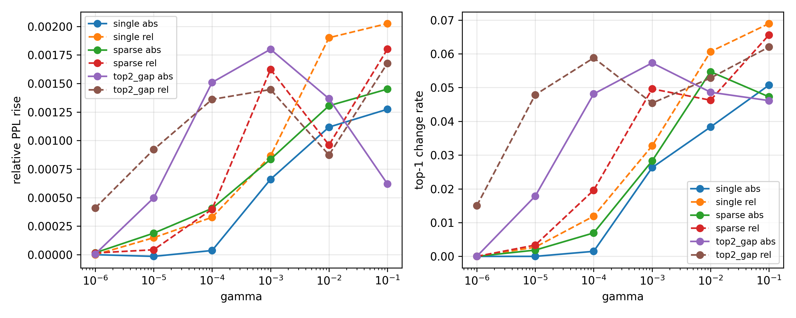
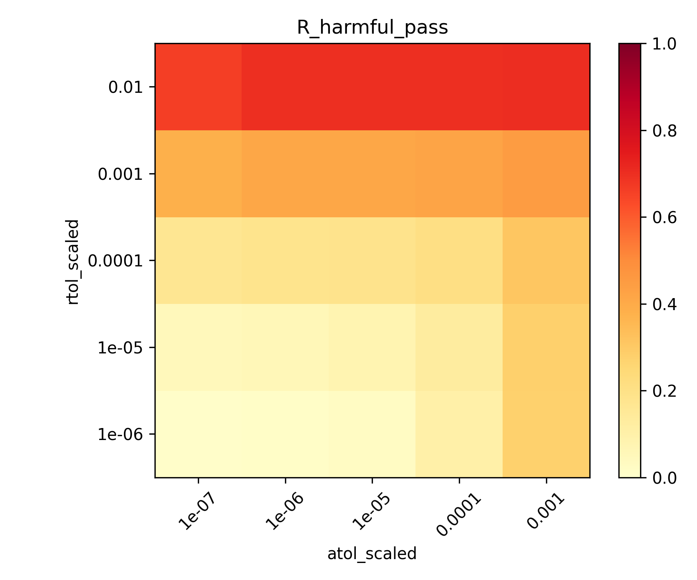
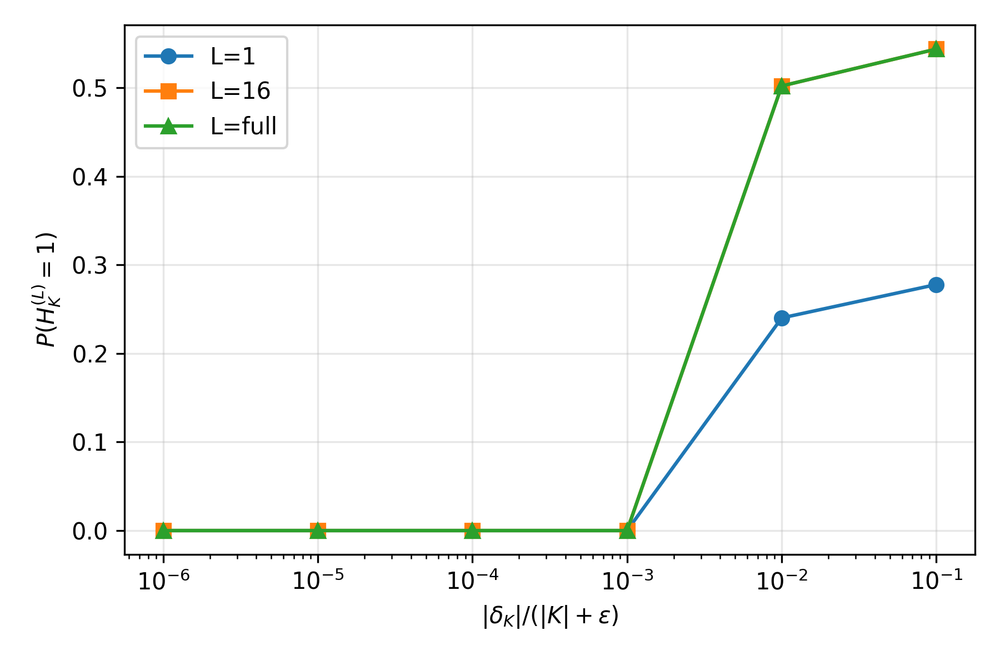
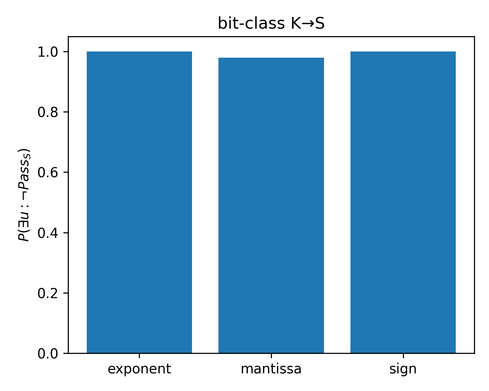
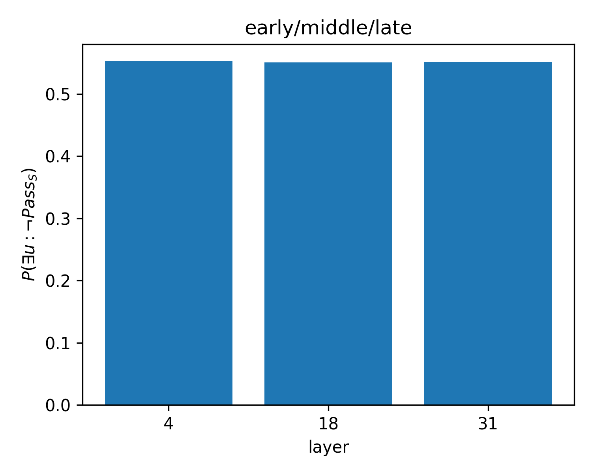
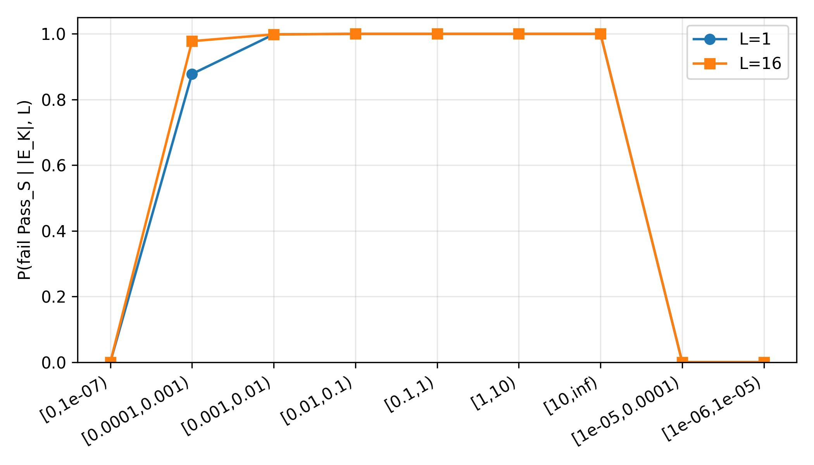
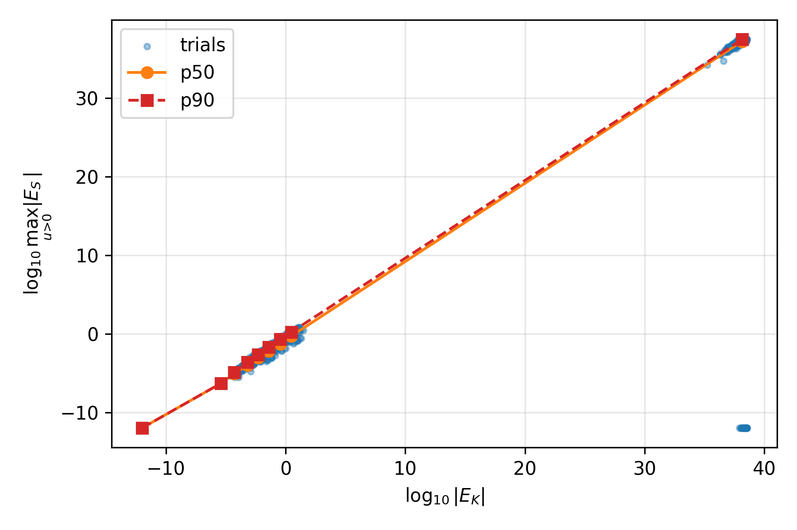
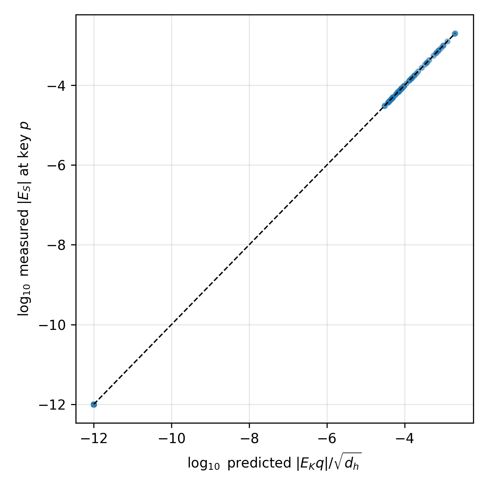

# small-exp2 第一阶段实验数据分析报告

对照 `TASK_SPEC.md` 第 1、3、7、10、11 节，以及设计文档 `EXP_A_S_TOLERANCE.md`、`EXP_B_K_LIFETIME.md`、`EXP_C_K_TO_S.md`。

- 运行档位：compact phase-1（满足规格 §6.3 最小值，非全因子笛卡尔积）
- 结果目录：`results/expA_phase1/`、`results/expB_phase1/`、`results/expC_phase1/`
- 语料哈希：`smallexp2_synthetic_lm_v1` v1.0，`data_hash=e66bd801d16986ac`
- 链完成时间：`2026-08-20T10:18:32Z`
- 选型只用 calibration；test 仅复核，未参与阈值选择
- smoke 结果（`expA_smoke*` / `expB_smoke` / `expC_smoke`）已被本报告覆盖，不作为结论来源

比例均给出 numerator / denominator、点估计和 Wilson 95% CI。相对 PPL 的区间来自按序列的 paired bootstrap。

---

## 1. 结论摘要

第一阶段只回答三个问题。不判断 K block、BER 或 ABFT。

### 问题 1：本次 attention score \(S\) 允许多大误差？

推荐使用实验 A 的 **balanced** 缩放容差，并换算为 raw 供 `small-exp1` 使用：

| 名称 | scaled \(r_S\) | scaled \(a_S\) | raw \(r_S\) | raw \(a_S\) |
|------|----------------|----------------|-------------|-------------|
| strict | \(10^{-6}\) | \(10^{-7}\) | \(10^{-6}\) | \(1.13\times 10^{-6}\) |
| **balanced（推荐）** | \(10^{-6}\) | \(10^{-5}\) | \(10^{-6}\) | \(1.13\times 10^{-4}\) |

其中 \(\sqrt{d_h}=\sqrt{128}\approx 11.31\)，故

\[
a_{S,\mathrm{raw}}=\sqrt{d_h}\,a_{S,\mathrm{scaled}}.
\]

工程接口：

```text
result_rtol = 1e-6
result_atol = 1.1313708498984762e-4
```

校准集上：

- strict：harmful-pass \(0.92\%\) \([0.66, 1.28]\)，benign-reject \(83.6\%\) \([82.9, 84.2]\)
- balanced：harmful-pass \(2.50\%\) \([2.05, 3.05]\)，benign-reject \(68.8\%\) \([68.0, 69.5]\)

规格要求必须评估的临时点 \((r_S,a_S)=(10^{-5},10^{-6})\) 的 harmful-pass 为 \(5.72\%\)，超过选型门槛 \(5\%\)，因此 **没有入选**。

### 问题 2：持久 K 误差能容忍到什么程度？

**没有证据支持单一 `K_rtol/K_atol`。** 应使用生命周期风险曲线，并注明稀疏度 = 每个样本 1 个 K 元素、decode 窗口 \(L\le 16\)。

全体校准故障（数值 + bitflip，\(n=4536\)）：

| 窗口 | \(H_K^{(L)}\) | 95% CI |
|------|---------------|--------|
| \(L=1\)（当前 query） | \(18.54\%\) (841/4536) | \([17.44, 19.70]\) |
| \(L=2\) | \(23.77\%\) (1078/4536) | \([22.55, 25.03]\) |
| \(L=16=\mathrm{full}\) | \(32.01\%\) (1452/4536) | \([30.67, 33.38]\) |

延迟危害（当前 query 无害、后续 query 有害）：\(13.47\%\) (611/4536)，CI \([12.51, 14.49]\)。相对 PPL：p95 \(1.04\%\)，p99 \(4.44\%\)，最差 \(53.4\%\)。

按数值相对扰动分层：存储相对误差 \(\le 10^{-3}\) 时 \(H_K=0\)；到 \(10^{-2}\) 时 \(H_K^{(16)}=50.2\%\)。指数位翻转是唯一同时产生 Inf/NaN 的类别。

### 问题 3：K 误差如何变成 S 误差？

恒等式 \(E_S=E_K q/\sqrt{d_h}\) 在有限数值探针上成立（96/96 相对误差 \(<5\%\)，中位 0，p90 \(0.29\%\)）。相对 balanced Pass_S，传递接近阶跃：

- 存储 \(|E_K|<10^{-4}\)：Pass_S 几乎全过
- 存储 \(|E_K|\ge 10^{-3}\)：Pass_S 几乎全不过

全寿命 \(P(\exists u:\neg\mathrm{Pass}_S)=55.16\%\) (2502/4536)，明显高于质量危害 \(32\%\)：S 检测器是质量预算的保守内界。未来 query 放大 \(\max|E_S|\) 的比例为 \(48.32\%\)。

---

## 2. 实验设置

### 2.1 模型与运行时

| 项 | 值 |
|----|----|
| 模型 | `/opt/data/data/models/Qwen3-8B` |
| 层数 / Q heads / KV heads | 36 / 32 / 8（GQA 4） |
| \(d_h\) | 128（从本地 `config.json` 读取，未假定） |
| 权重 / 激活 / KV cache | bfloat16 / bfloat16 / auto（实测 BF16） |
| 框架 | vLLM `0.8.5.post1`（`/opt/data/data/workspace-vllm`） |
| PyTorch / CUDA / GPU | 2.6.0+cu124 / 12.4 / RTX 4090 |
| attention backend | `FLASH_ATTN_VLLM_V1` |
| 生成 | greedy；`enforce_eager=true`；关闭 prefix cache |
| 环境约束 | `VLLM_ENABLE_V1_MULTIPROCESSING=0` |

自动几何：early / middle / late = **第 4 / 18 / 31 层**。实验 A 每层 2 个 Q head；实验 B/C 每层 2 个 **KV head**（不是 Q head）。

| 实验 | 层 → head |
|------|-----------|
| A | L4: Q 18,22；L18: Q 21,23；L31: Q 13,19 |
| B/C | L4: KV 4,5；L18: KV 1,7；L31: KV 0,1 |

### 2.2 数据与采样

数据集 `smallexp2_synthetic_lm_v1`：非重叠打包 256-token 序列 + 1 个 target，无 special tokens。216 条序列划分为 calibration 196 / test 20。注入子集：cal 84 条、test 20 条。上下文位置：64 与 256。seed：42, 43, 44。`max_tokens=16`。未做 densify。

Compact 注入位置（每个条件）：

\[
84\ \text{cal seq}\times 1\ \text{cycled layer}\times 2\ \text{ctx}\times 3\ \text{seeds}=504
\]

满足「每条件 ≥500 独立注入位置」。语料普查：196 条 cal 序列 × 256 token ≈ **50,176** 个 unique clean token，满足「≥50,000」。

| 实验 | 校准故障试验 | 测试故障试验 | 条件数 |
|------|-------------|-------------|--------|
| A | 18,144 | 4,320 | 3 mode × 2 abs/rel × 6 γ = 36 |
| B | 4,536 | 1,080 | 6 numeric rel + 3 bit class = 9 |
| C | 沿用 B 的 4,536 + 恒等式探针 | 不用于选型 | 无新故障 |

注错对象：只动选定层的 \(S\)（A）或单个 K 元素（B）。q、V、权重不注错。clean 与 faulted 配对、同一 reference 路径。

### 2.3 质量预算与有害定义

规格 §7.3 的暂定预算（不是论文最终口径）：

- 相对 PPL 上升 \(\le 0.1\%\)（序列均值 95% CI 上界 \(\le 0.2\%\)）
- greedy top-1 改变率 \(\le 0.1\%\)
- 无额外 NaN/Inf
- 必须看 p95 / p99 / 最坏样本

实现（`smallexp2/metrics.py`）将一条试验标为有害，当且仅当：相对 PPL 上升 \(>0.001\)，或 top-1 改变率 \(>0.001\)，或出现额外 NaN/Inf。生成长度为 16 时，**任意一个 greedy token 翻转** 的改变率是 \(1/16=6.25\%>0.1\%\)，因此有害标签主要由 top-1 翻转驱动，而不是由平均 PPL 驱动。下文质量曲线必须同时读「有害率」和「相对 PPL」。

\(H_K^{(L)}\) 对更短窗口取 OR，因此随 \(L\) 单调不减。本轮 `max_tokens=16`，故 \(L=16\) 与 \(L=\mathrm{full}\) 数值相同。

### 2.4 FlashAttention 与 reference 路径

选定层在 `reshape_and_cache_flash` 写入真实 paged KV 后，用可观测的 reference attention 计算 scaled score \(S=QK^\top/\sqrt{d_h}\)。无注错时 flash vs reference（layer 4，ctx 256，16 token）：

| 指标 | 结果 |
|------|------|
| greedy 首次分叉 | 无（`first_divergence=null`） |
| top-1 不一致 | 0/16 |
| PPL flash / ref | 1.000637 / 1.000656 |
| logits max-abs / rel-L2 | 0.172 / \(7.53\times 10^{-3}\) |
| attention output max-abs | \(1.95\times 10^{-3}\) |
| NaN/Inf | 无 |

一致性检查通过：reference 路径可作为注入与观测接口。logits 的 max-abs 来自 bf16 与 kernel 差异，greedy 路径未分叉。

### 2.5 运行时间

`results/phase1_chain.log`（UTC）：

| 阶段 | 开始 | 约耗时 |
|------|------|--------|
| A calibration | 03:41:46 | ~3.9 h |
| A test | 07:35:45 | ~1.0 h |
| B calibration | 08:35:13 | ~1.2 h |
| B test | 09:46:02 | ~0.4 h |
| C（分析 + 恒等式探针） | 10:08:01 | ~0.2 h |
| 链结束 | 10:18:32 | 合计 ~6.6 h |

---

## 3. 实验 A：S 直接扰动

设计见 `docs/EXP_A_S_TOLERANCE.md`。只在当前 query（prefill 最后一行）注入 \(E_S\)，decode 不再注错。三类形态：`single` / `sparse`（约 1% 有效 score，上限 8）/ `top2_gap`；绝对与相对各一套；\(\gamma\in\{10^{-6},\ldots,10^{-1}\}\)。

原始表：`results/expA_phase1/tables/`。图：

- `../results/expA_phase1/figures/s_error_vs_quality.png`
- `../results/expA_phase1/figures/harmful_pass_heatmap.png`





### 3.1 质量随 \(\gamma\) 的变化

每格 \(n=504\)。相对 PPL 为序列均值；有害率为试验级比例。

**single，绝对误差** \(|E_i|=\gamma\)：

| \(\gamma\) | 相对 PPL | top-1 改变率 | 有害率 (k/504) |
|------------|----------|--------------|----------------|
| \(10^{-6}\) | \(0\) | \(0\) | \(0\%\) (0) |
| \(10^{-5}\) | \(-0.0015\%\) | \(0\) | \(0\%\) (0) |
| \(10^{-4}\) | \(0.0036\%\) | \(0.15\%\) | \(2.98\%\) (15) |
| \(10^{-3}\) | \(0.066\%\) | \(2.63\%\) | \(13.1\%\) (66) |
| \(10^{-2}\) | \(0.112\%\) | \(3.83\%\) | \(26.6\%\) (134) |
| \(10^{-1}\) | \(0.127\%\) | \(5.07\%\) | \(33.5\%\) (169) |

**single，相对误差** \(|E_i|=\gamma|S_i|\)：\(\gamma=10^{-6}\) 时有害仅 1/504；\(\gamma=10^{-5}\) 起 top-1 开始翻转。

**top2_gap，相对**：最敏感。\(\gamma=10^{-6}\) 已有有害率 \(9.13\%\) (46/504)、top-1 \(1.50\%\)。这是把容差收到 \(r_S=10^{-6}\) 的直接原因：定向缩小 top-1/top-2 间隔时，极小 \(E_S\) 也能改 greedy 决策。

**sparse** 介于 single 与 top2_gap 之间。

即使 \(\gamma=10^{-1}\)，各形态平均相对 PPL 仍 \(\le 0.20\%\)，p95 相对 PPL 大约 \(1\%\)–\(1.7\%\)。有害率 \(30\%\)–\(40\%\) 与平均 PPL 脱节，符合 §2.3：单 token 翻转即超预算。PPL 不能单独当判据。

### 3.2 Pass_S 网格与选型

候选 \(r_S\in\{10^{-6},\ldots,10^{-2}\}\)、\(a_S\in\{10^{-7},\ldots,10^{-3}\}\)，必须包含 \((10^{-5},10^{-6})\)。校准故障 18,144 条中，有害 3,795、可接受 14,349。

选型规则（`pick_recommendation`）：

1. **strict**：harmful-pass 最小的一对（并列则更紧的 rtol/atol）
2. **balanced**：在 harmful-pass \(\le 5\%\) 的候选中，benign-reject 最小的一对（更松、误拒更少）
3. **raw**：balanced 的 scaled 值按 \(\sqrt{d_h}\) 换算 atol

关键行（scaled）：

| \(r_S\) | \(a_S\) | harmful-pass | benign-reject | 角色 |
|---------|---------|--------------|---------------|------|
| \(10^{-6}\) | \(10^{-7}\) | 35/3795 = **0.92%** [0.66, 1.28] | 11989/14349 = **83.6%** | **strict** |
| \(10^{-6}\) | \(10^{-6}\) | 46/3795 = 1.21% | 78.3% | 中间 |
| \(10^{-6}\) | \(10^{-5}\) | 95/3795 = **2.50%** [2.05, 3.05] | 9869/14349 = **68.8%** | **balanced / raw 来源** |
| \(10^{-6}\) | \(10^{-4}\) | 393/3795 = 10.4% | 52.0% | HP>5%，淘汰 |
| \(10^{-5}\) | \(10^{-7}\) | 192/3795 = 5.06% | 64.5% | 略高于 5%，淘汰 |
| \(10^{-5}\) | \(10^{-6}\) | 217/3795 = **5.72%** [5.02, 6.50] | 61.4% | TASK_SPEC required，淘汰 |
| \(10^{-2}\) | \(10^{-3}\) | 70.0% | 14.1% | 过松 |

balanced 是「HP≤5%」约束下最松的一对，不是 HP 最低的一对。后续 B/C 的 Pass_S 使用 balanced，因此 K→S「超容差」是相对这条工程阈值，不是相对 strict。

### 3.3 测试集复核（未用于选型）

`results/expA_phase1/tables/test_check.json`，`used_for_selection=false`，\(n=4320\)。

| 指标 | 校准 | 测试 |
|------|------|------|
| 有害率 | 3795/18144 = 20.9% | 796/4320 = 18.4% [17.3, 19.6] |
| strict harmful-pass | 0.92% [0.66, 1.28] | 10/796 = **1.26%** [0.68, 2.30] |
| balanced harmful-pass | 2.50% [2.05, 3.05] | 22/796 = **2.76%** [1.83, 4.15] |
| strict benign-reject | 83.6% | 2972/3524 = 84.3% |
| balanced benign-reject | 68.8% | 2457/3524 = 69.7% |

测试点估计略高，但 95% CI 与校准重叠，没有把容差拟合到校准集的迹象。

### 3.4 A 的限制

- 只扰动当前 query，不模拟「算错一次、错误残留在 S 里被反复用」——那是 K 的问题。
- 未加密 \(\gamma\) 网格；拐点已落在 \(10^{-5}\)–\(10^{-3}\)，足够支撑 rtol 选型。
- compact：每条序列只 cycle 一层，不是三层全做。

---

## 4. 实验 B：持久 K-cache

设计见 `docs/EXP_B_K_LIFETIME.md`。`reshape_and_cache_flash` 写入真实 paged cache 后，立刻修改 **一个** 已存在的 K 元素，后续 query **不恢复**。\(S^{\mathrm{clean}}\) 在 gather 副本上还原该元素后计算，不得把「读了错误 K 再正确重算」当作 clean。

数值相对扰动 \(\{10^{-6},\ldots,10^{-1}\}\)；BF16 bitflip 取 bit15（sign）、bit14（exponent）、bit0（mantissa）。S 容差 = A balanced scaled \((10^{-6},10^{-5})\)。

原始表：`results/expB_phase1/tables/k_tolerance.csv`、`recommendation.json`。图：

- `../results/expB_phase1/figures/k_lifetime_harm.png`
- `../results/expB_phase1/figures/k_bitclass.png`
- `../results/expB_phase1/figures/k_layer.png`
- `../results/expB_phase1/figures/k_to_s_scatter.png`







### 4.1 总体生命周期曲线

校准 \(n=4536\)。`recommendation.json` 明确：`single_k_rtol=null`，`use_risk_curves=true`。

延迟危害 13.5% 说明：**用当前 query 代替生命周期会低估约 42% 的质量危害**（\(13.5/32.0\)）。\(H_K^{(1)}=18.5\%\) 升到 \(H_K^{(16)}=32.0\%\)，增量几乎全部发生在 \(L=2\) 与 \(L=16\) 之间；\(L=16\) 已饱和。

相对 PPL 尾部很重：p95 仅 1.04%，最差 53.4%。少数指数翻转或大数值扰动主导最坏样本。

### 4.2 数值相对误差

每档 \(n=504\)（layer=`all`）。

| 意图 rel | \(H_K^{(1)}\) | \(H_K^{(16)}\) | 延迟危害 | Wilson 上界（零事件） |
|----------|---------------|----------------|----------|------------------------|
| \(10^{-6}\) | 0 | 0 | 0 | 0.76% |
| \(10^{-5}\) | 0 | 0 | 0 | 0.76% |
| \(10^{-4}\) | 0 | 0 | 0 | 0.76% |
| \(10^{-3}\) | 0 | 0 | 0 | 0.76% |
| \(10^{-2}\) | 24.0% [20.5, 27.9] | **50.2%** [45.8, 54.5] | 26.2% | — |
| \(10^{-1}\) | 27.8% [24.0, 31.8] | **54.4%** [50.0, 58.7] | 26.6% | — |

质量危害在意图 rel \(10^{-3}\) 与 \(10^{-2}\) 之间出现悬崖。实验 C 表明，意图 \(10^{-6}\)–\(10^{-4}\) 的存储 \(\lvert E_K\rvert\) 经常被 BF16 量化成 0，这些试验物理上近似无故障，\(H_K=0\) 不能解释成「模型能吞下 \(10^{-4}\) 的真实存储误差」。意图 \(10^{-3}\) 有一部分能写入非零 \(\lvert E_K\rvert\)（见 §5.2），但 **仍达不到质量预算**；要打穿 PPL/top-1，需要大约 **1% 相对 K 误差**（在本稀疏度下）。

\(10^{-2}\) 与 \(10^{-1}\) 的 \(H_K^{(16)}\) 接近（50% vs 54%），延迟危害几乎相同（~26%）：一旦相对扰动大到改变 greedy 路径，再增大一个数量级，在单元素稀疏度下收益有限。

### 4.3 BF16 bitflip

每类 \(n=504\)。

| 类 | \(H_K^{(1)}\) | \(H_K^{(16)}\) | 延迟危害 | Pass_S 全寿命失败 | 非有限 \(E_S\) |
|----|---------------|----------------|----------|-------------------|----------------|
| mantissa (bit 0) | 23.4% [19.9, 27.3] | 50.4% [46.0, 54.7] | 27.0% | 98.0% (494/504) | 0 Inf / 0 NaN |
| sign (bit 15) | 23.2% [19.7, 27.1] | 48.6% [44.3, 53.0] | 25.4% | 100% (504/504) | 0 Inf / 0 NaN |
| exponent (bit 14) | **68.5%** [64.3, 72.4] | **84.5%** [81.1, 87.4] | 16.1% | 100% (504/504) | 103 Inf + 101 NaN（有限 300） |

mantissa / sign 的质量曲线与数值 rel \(10^{-2}\) 几乎同构：当前 query 约 1/4 有害，生命周期约 1/2 有害，一半以上是延迟的。指数翻转立即严重，延迟比例反而更低（多数在 \(L=1\) 已经有害），并且是唯一的 Inf/NaN 来源。

Pass_S 失败率远高于 \(H_K\)：符号翻转 100% 超 S 容差，但质量有害只有 49%。S 层报警 ≠ 模型层已坏。

### 4.4 层位

Pass_S 全寿命失败在三层几乎相同（55.22% / 55.09% / 55.16%）。质量危害则 **late 层更抗打**：

以 \(H_K^{(16)}\) 为例（每格 \(n=168\)）：

| 故障 | L4 early | L18 middle | L31 late |
|------|----------|------------|----------|
| exponent | 88.1% | 85.1% | 80.4% |
| mantissa | 56.0% | 54.8% | 40.5% |
| sign | 57.7% | 50.6% | 37.5% |
| numeric \(10^{-2}\) | 56.5% | 53.6% | 40.5% |

层 31 的 mantissa/sign/1% 数值扰动比层 4 低约 15–20 个百分点。S 是否超容差几乎与层无关（误差是否大于 \(a_S+r_S|S|\) 是局部算术），最终 token 是否改口则与该层对 logits 的杠杆有关。第一阶段不能把「layer 不敏感」说成 Pass_S 与 \(H_K\) 都成立——只对前者成立。

### 4.5 测试集复核

`results/expB_phase1/tables/test_check.json`，\(n=1080\)，未用于选型。

| 指标 | 校准 | 测试 |
|------|------|------|
| \(H_K^{(1)}\) | 18.5% [17.4, 19.7] | 18.7% [16.5, 21.1] |
| \(H_K^{(2)}\) | 23.8% | 24.2% [21.7, 26.8] |
| \(H_K^{(16)}\) | 32.0% [30.7, 33.4] | 29.9% [27.3, 32.7] |
| 延迟危害 | 13.5% | 11.2% [9.5, 13.2] |
| 相对 PPL p95 / p99 / 最差 | 1.04% / 4.44% / 53.4% | 1.10% / 4.55% / 11.4% |
| \(P(\mathrm{fail\ Pass}_S)\) full | 55.2% | 55.4% |
| 未来放大 | 48.5% | 49.8% |

寿命曲线与 Pass_S 失败率与校准一致。测试最差相对 PPL（11.4%）低于校准（53.4%），符合「最坏样本由少数指数翻转驱动、test 更小」的抽样波动，不改变分层结论。

---

## 5. 实验 C：K→S 传播

设计见 `docs/EXP_C_K_TO_S.md`。C 不引入新故障。主数据是 B 的 `trials.jsonl`；另做恒等式探针，核对损坏 key 列上

\[
E_{S,u,h,p}=\frac{\delta_K\,q_{u,h,j}}{\sqrt{d_h}},\quad h\in\mathrm{GQA}(h_{\mathrm{kv}}).
\]

S 容差与 B 相同：A balanced scaled。图：

- `../results/expC_phase1/figures/k_to_s_pass_by_ek.png`
- `../results/expC_phase1/figures/k_to_s_scatter.png`
- `../results/expC_phase1/figures/k_to_s_identity.png`
- `../results/expC_phase1/figures/k_to_s_by_query.png`
- `../results/expC_phase1/figures/k_bitclass.png`
- `../results/expC_phase1/figures/k_layer.png`







### 5.1 总体传递

校准 \(n=4536\)：

| 统计 | 点估计 | 95% CI |
|------|--------|--------|
| \(P(\neg\mathrm{Pass}_S)\) at \(L=1\) | 54.76% (2484/4536) | [53.31, 56.21] |
| \(P(\exists u:\neg\mathrm{Pass}_S)\) full | 55.16% (2502/4536) | [53.71, 56.60] |
| 未来 query 放大 \(\max|E_S|\) | 48.32% (2192/4536) | [46.87, 49.78] |

Pass_S 失败几乎都发生在当前 query（\(L=1\) 与 full 只差 18 条）。这与质量危害的强延迟形成对照：S 残差立刻超过 \(10^{-5}\) 量级容差，但 greedy 决策往往要等后续 \(q_u\) 才被撬动。

增益中位数 \(g=\max|E_S|/(|E_K|+\epsilon)\approx 0.09\)–\(0.11\)，接近 \(1/\sqrt{128}\approx 0.088\)（当 \(|q|\sim 1\)）。与恒等式一致。

### 5.2 按存储 \(|E_K|\) 分箱

`k_to_s_by_ek_bin.csv`。意图 rel 与存储 \(\lvert E_K\rvert\) 不是一一对应：BF16 会把过小的 \(\delta_K\) 量化掉。

合并 numeric + bitflip 后的阶跃（\(L=1\) fail Pass_S）：

| 存储 \(\lvert E_K\rvert\) 箱 | \(n\) | fail \(L=1\) | fail \(L=16\) |
|------------------------------|-------|--------------|---------------|
| \([0,10^{-7})\) | 2016（全部 numeric） | **0%** | 0% |
| \([10^{-6},10^{-5})\) | 2 | 0% | 0% |
| \([10^{-5},10^{-4})\) | 11 | 0% | 0% |
| \([10^{-4},10^{-3})\) | 180 | **87.8%** | 97.8% |
| \([10^{-3},10^{-2})\) | 620 | **99.8%** | 99.8% |
| \(\ge 10^{-2}\) 有限 | 1065+ | 100% | 100% |
| nonfinite | 103（exponent） | 100% | 100% |

2016 条落在 \([0,10^{-7})\)，正好是 4 档意图 rel \(\{10^{-6},10^{-5},10^{-4},10^{-3}\}\) 中被量化掉的主体（\(4\times 504=2016\)）。因此：

- 「意图 rel \(\le 10^{-3}\) 时 \(H_K=0\)」混杂了 **未真正写入的故障**；
- 一旦存储 \(\lvert E_K\rvert\) 进入 \([10^{-4},10^{-3})\)，Pass_S 已有约 88% 失败，但 §4.2 的质量 \(H_K\) 仍为 0；
- \(\lvert E_K\rvert\ge 10^{-3}\) 时 Pass_S 失败饱和，质量危害要到 \(\sim 10^{-2}\) 才出现。

**S 容差相对质量预算大约紧 1 个数量级（在单元素、本 balanced 对下）。**

numeric 与 bitflip 在同一 \(|E_K|\) 箱内的 fail 率几乎重合（例如 \([10^{-4},10^{-3})\)：bitflip 87.9% vs numeric 87.7%）。传递由存储幅度主导，不由「这是数值扰动还是尾数翻转」主导。指数溢出是例外，走 nonfinite 箱。

### 5.3 恒等式探针

128 条 identity 记录，其中有限数值 96 条：

| 指标 | 值 |
|------|----|
| \(\lvert\mathrm{rel\ err}\rvert\) 中位 | 0 |
| p90 | 0.293% |
| \(\lvert\mathrm{rel\ err}\rvert<5\%\) | 96/96，Wilson 下界 96.2% |

意图 rel \(10^{-4}\) 与部分 \(10^{-3}\) 的 `abs_delta_k=0`（与主实验量化结论一致），预测与观测 \(E_S\) 同为 0，相对误差记 0。意图 \(10^{-2}\) 与 mantissa 翻转给出非零 \(\delta_K\)，相对误差在 \(10^{-4}\)–\(2\%\)。32 条非有限记录来自指数类，不进入相对误差汇总。

结论：选定层 reference 路径上，损坏 key 列的 scaled \(E_S\) 就是 \(E_K q/\sqrt{d_h}\)，没有额外的 fused 缩放或写错 cache 平面。

### 5.4 bit 类、层、head、query、上下文

**bit 类**（各 504）：exponent / sign 的 Pass_S 失败 100%；mantissa \(L=1\) 95.8% → \(L=16\) 98.0%。mantissa 的未来放大高达 93.8%（残差小，后续 \(|q|\) 很容易刷新 \(\max|E_S|\)）；exponent 的未来放大只有 58.7%，且 `max_es_future` 的 p50 已是 \(10^{36}\) 量级。

**层**：fail Pass_S full = 55.02% / 55.09% / 55.22%（L18 / L31 / L4），CI 完全重叠。

**KV head**：6 个 (layer, kv_head) 格子各 756 条，fail 在 54.2%–55.5%，无突出 head。

**query 下标 \(u=0\ldots 15\)** × ctx 64/256：每格 \(n=2268\)，fail_s 在 54.5%–55.1%。ctx 256 的 `max_es` 中位数略高于 ctx 64（约 \(1.0\times 10^{-4}\) vs \(8\times 10^{-5}\)），fail 率差不到 1 个百分点。第一阶段看不到「长上下文明显更放大」的效应——单元素误差只打一条 key 列，上下文变长主要增加未被打中的 score。

### 5.5 与质量层的关系

把 A/B/C 对齐到同一套预算：

1. 存储 \(\lvert E_K\rvert\approx 0\)（BF16 量化）：Pass_S 过、\(H_K=0\)。
2. \(\lvert E_K\rvert\sim 10^{-4}\)–\(10^{-3}\)：Pass_S 几乎必失败，\(H_K=0\)。S 检测器先响。
3. \(\lvert E_K\rvert\sim 10^{-2}\) 或 sign/mantissa flip：Pass_S 失败；约一半试验在 16 token 内打穿质量预算，其中约一半是延迟的。
4. exponent flip：Pass_S 失败，常伴随 Inf/NaN，\(H_K^{(16)}\approx 85\%\)。

若后续 ABFT 只守护 Pass_S，会比质量预算更勤地报警。若只按质量预算设阈，会漏掉已经越 S 容差、但尚未改口的故障；那些故障仍可能被未来 \(q\) 放大（B 延迟危害 13.5%）。

---

## 6. 交付对照 TASK_SPEC §11

### S 层

```text
strict_s_rtol_scaled    = 1e-6
strict_s_atol_scaled    = 1e-7
balanced_s_rtol_scaled  = 1e-6
balanced_s_atol_scaled  = 1e-5
recommended_s_rtol_raw  = 1e-6
recommended_s_atol_raw  = 1.1313708498984762e-4
result_rtol             = 1e-6
result_atol             = 1.1313708498984762e-4
```

来源：`results/expA_phase1/tables/recommendation.json`。

### K 层

- 不给出单一 K 容差。
- 数值：rel \(\le 10^{-3}\) 在本 dtype/稀疏度下质量无害（含量化零故障）；rel \(10^{-2}\) 起 \(H_K^{(16)}\approx 50\%\)。
- bitflip：mantissa ≈ sign ≈ 数值 1%；exponent 显著更差并产生 Inf/NaN。
- 延迟危害 13.5%；必须报 \(L\in\{1,2,16,\mathrm{full}\}\) 曲线。
- 稀疏度声明：每样本 1 个 K 元素；\(L\le 16\)。

### K→S

- 经验映射由存储 \(|E_K|\) 分箱给出，近似阶跃，阈值在 \(10^{-4}\)–\(10^{-3}\)。
- \(P(\exists u:\neg\mathrm{Pass}_S\mid E_K)\) 在 balanced 对下为 55.2%（全体故障混合）；条件于 \(|E_K|\ge 10^{-3}\) 时 ≈ 100%。
- layer / KV head / query 下标 / 64 vs 256 对 Pass_S 失败率无实质差；质量危害 late 层略低。
- 恒等式在有限数值探针上成立。

---

## 7. 规格完成情况（§12）

| # | 要求 | 状态 |
|---|------|------|
| 1 | Conda 环境 | 本机使用已有 `vllm0.8.5`；与规格示例名不同，不影响结果 |
| 2 | clean baseline 可复现 | `baseline_metrics.csv` + 固定 seed/greedy/eager |
| 3 | S 三类扰动 | single / sparse / top2_gap，abs+rel，6 个 γ |
| 4 | 单 K 数值 + bitflip 持久 cache | 6 rel + sign/exponent/mantissa |
| 5 | 当前与后续 query 的 K→S | \(u=0\ldots 15\)，窗口 1/2/16/full |
| 6 | S strict/balanced + CI | §3.2 |
| 7 | K 生命周期曲线，不用单次 q 代替 | §4.1 |
| 8 | test 未参与选型 | `used_for_selection=false` |
| 9 | 原始计数、配置、seed、环境 | 各 run 的 `config.json` / `environment.json` / `raw/` |
| 10 | 限制写明，不外推 block/BER/ABFT | §8 |

图表（规格 §10）：A 质量曲线与 HP 热图；B 寿命 / bit 类 / 层；C 分箱 Pass_S、散点、恒等式、按 query。均有 PDF 与 300-DPI PNG。

---

## 8. 限制（不得外推）

1. **Compact 而非全因子。** 每条序列只 cycle 一层；未遍历全部 layer/head；未加密 γ。
2. **单 K 元素稀疏度。** 不能代表一个 K block、一次突发多 bit、或真实 BER 下的累积。
3. **decode 仅 16 token。** \(L=\mathrm{full}\) 被截断；更长生成可能继续抬高 \(H_K\) 与延迟危害。
4. **质量预算是暂定口径。** 单 token 翻转即有害，有害率显著高于平均相对 PPL。若应用只关心平均 PPL，本报告的 \(H_K\) 偏保守；若应用关心 greedy 轨迹，则口径合适。
5. **BF16 量化。** 意图 rel \(\le 10^{-3}\) 的「无害」不能直接写成「硬件可允许 \(10^{-3}\) 相对误差」；许多试验根本没有写入非零 \(E_K\)。
6. **合成 LM 语料。** `smallexp2_synthetic_lm_v1`，不是下游任务。
7. **不回答：** K block 大小、BER campaign、ABFT / DMR / checksum、\(\tau_0/\tau_1\)、64-token 硬件组织、与 small-exp1 的联合优化。
8. **raw 容差来自 balanced 而非 strict。** 若 small-exp1 需要更低漏检，应改用 strict（scaled atol \(10^{-7}\)，raw atol \(\approx 1.13\times 10^{-6}\)），并接受更高误拒。

---

## 9. 对后续阶段的含义

在现有证据下，与 small-exp1 对接时建议：

1. **S 侧**先接入 `result_rtol=1e-6`、`result_atol=1.13e-4`（balanced raw）。若 ABFT 误报过多，再评估是否放松；若漏检不可接受，改 strict。
2. **K 侧不要设单一 rtol。** 按错误类给风险：指数位必须当致命；尾数/符号/约 1% 相对误差在单元素、16 token 窗口下约 50% 机会打穿 greedy 预算，且常延迟。
3. **检测阈值与纠错阈值应分开。** Pass_S 在 \(|E_K|\sim 10^{-3}\) 已饱和，质量危害在 \(\sim 10^{-2}\) 才升起。\(\tau_0\)（报警）可以对齐 S；\(\tau_1\)（触发纠错/回滚）可以按可接受的 \(H_K^{(L)}\) 再松一档，并显式依赖 \(L\)。
4. 下一阶段优先：非零存储 \(\lvert E_K\rvert\) 的条件分析（排除量化零）、多元素/block 稀疏度、更长 \(L\)、以及按真实 BER 注入指数位。

---

## 附录 A. 关键文件

| 内容 | 路径 |
|------|------|
| 本报告 | `docs/PHASE1_DATA_ANALYSIS_REPORT.md` |
| 任务规格 | `TASK_SPEC.md` |
| A/B/C 设计 | `docs/EXP_A_S_TOLERANCE.md` 等 |
| A 推荐与测试 | `results/expA_phase1/tables/recommendation.json`、`test_check.json` |
| A 质量 / 容差网格 | `s_quality_curves.csv`、`s_tolerance.csv` |
| B 寿命与测试 | `results/expB_phase1/tables/k_tolerance.csv`、`test_check.json` |
| C 分箱与恒等式 | `results/expC_phase1/tables/k_to_s_by_ek_bin.csv`、`identity_check.csv` |
| 环境指纹 | 各 run 的 `environment.json` |
| 链日志 | `results/phase1_chain.log` |

## 附录 B. 实验 A 全形态有害率（校准，每格 n=504）

| mode | rel | \(\gamma=10^{-6}\) | \(10^{-5}\) | \(10^{-4}\) | \(10^{-3}\) | \(10^{-2}\) | \(10^{-1}\) |
|------|-----|---------------------|-------------|-------------|-------------|-------------|-------------|
| single | abs | 0.0 | 0.0 | 3.0 | 13.1 | 26.6 | 33.5 |
| single | rel | 0.2 | 3.4 | 8.1 | 21.6 | 32.3 | 37.3 |
| sparse | abs | 0.2 | 1.4 | 7.1 | 25.4 | 34.1 | 36.5 |
| sparse | rel | 0.6 | 4.2 | 17.5 | 33.1 | 34.9 | 40.5 |
| top2_gap | abs | 0.4 | 6.9 | 29.8 | 39.3 | 38.3 | 36.9 |
| top2_gap | rel | 9.1 | 28.0 | 36.1 | 39.3 | 37.1 | 37.1 |

单位：有害率 %。top2_gap 在 \(\gamma\ge 10^{-3}\) 后趋于饱和（~37–39%），再增大间隔扰动不再抬高 greedy 翻转率。
